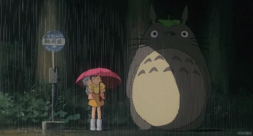

 

<!--  -->

---

### Sobre mim

🐒 • Atualmente, estou em busca de oportunidades profissionais na área de programação, motivado pela minha paixão pela tecnologia. Desejo explorar diversas áreas da profissão, com o objetivo de aprimorar minhas habilidades e alinhar-me às demandas do mercado de trabalho.

🎓 • Técinco em Análise e Desenvolvimento de Sistemas na instituição de ensino [Sistema FIEP/SESI/SENAI/IEL - Dois Vizinhos](https://www.senaipr.org.br/doisvizinhos).

🔎 • As áreas que mais me interessam atualmente são: desenvolvedor backend, desenvolvedor frontend e analista de qualidade.

---

### Eu já utilizei... 🔧 

**Tecnologias e Ferramentas** 

---

  

  

---

<h2 align=center> Entre em contato comigo! 📭 </h2>
<table align="center">
<tr>
<td>
  <a style="float:left;" href="https://www.linkedin.com/in/davi-machado-carvalho-656851251/" target="_blank"><a>
</td>
<td>
  
</td>
<td>
   
</td>
</tr>
</table>

<picture align="center">
  <source media="(prefers-color-scheme: light)" srcset="https://raw.githubusercontent.com/renancassi/renancassi/output/github-contribution-grid-snake-dark.svg">
  <source media="(prefers-color-scheme: dark)" srcset="https://raw.githubusercontent.com/renancassi/renancassi/output/github-contribution-grid-snake-dark.svg">
  
</picture>
